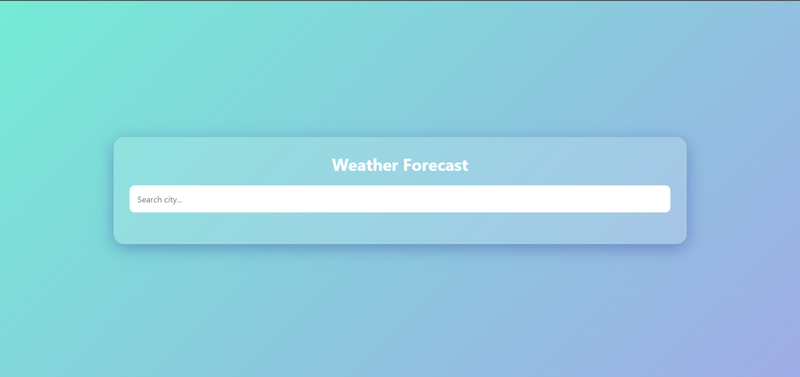

# 🌦️ Weather Forecast App

## About the Project

This is a simple Weather Forecast web application built using **HTML, CSS, and JavaScript**. It uses **WeatherAPI** to fetch real-time weather information. Users can search for any city and view the current weather, temperature, humidity, wind speed, and a 7-day weather forecast.

## Features

- Search weather by city name
- Real-time weather information
- Current temperature
- Humidity and wind speed
- Weather condition with icons
- 7-day weather forecast
- Responsive design

## Technologies Used

- HTML
- CSS
- JavaScript
- WeatherAPI

## Screenshots

### 🏠 Home Page

---

### 🔍 Search Weather

---

### 🌤️ Weather Details

---

## How to Run

1. Clone or download this repository.
2. Open the project folder.
3. Add your WeatherAPI key in the JavaScript file.
4. Open `index.html` in your browser.
5. Search for any city to view the weather details.

## What I Learned

- Fetching data from an API
- Working with JSON data
- DOM manipulation using JavaScript
- Building responsive web pages
- Displaying dynamic weather information

## Future Improvements

- Hourly weather forecast
- Auto-detect user location
- Save favorite cities
- Air Quality Index (AQI)
- Dark mode

## Author

**Abhinav Reddy**

GitHub: https://github.com/abhinavreddy1310

